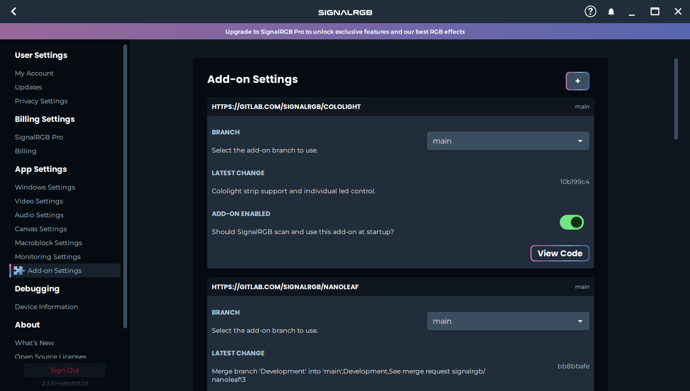

# SignalRGB plugins

Tbh it only has the Logitech x56 H.O.T.A.S. because I wanted the little leds to blink and Logitech didn't add the device on GHub.

This repo has a gnu v3 license but tbh you can do whatever you want with it.

## How to use

Open SignalRGB, go to `Settings` -> `Add-on Settings`, click the big `+` sign at the top and paste `https://github.com/franco-roura/SignalRGB-Plugins` in the text box.